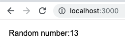
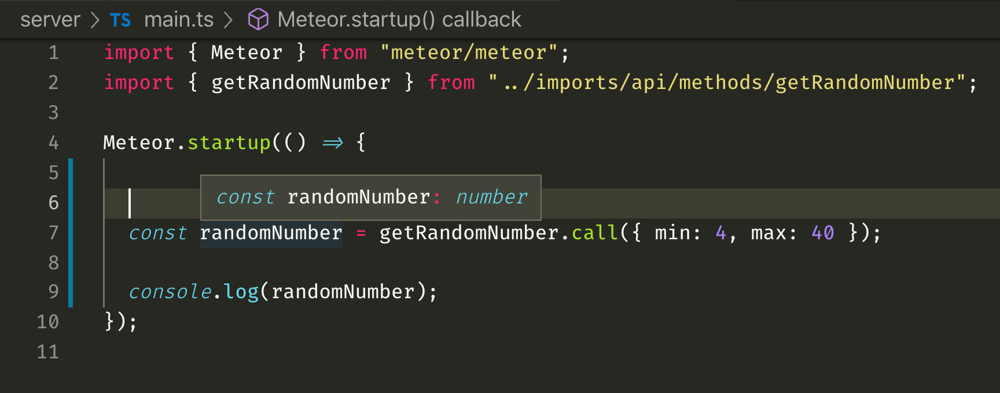
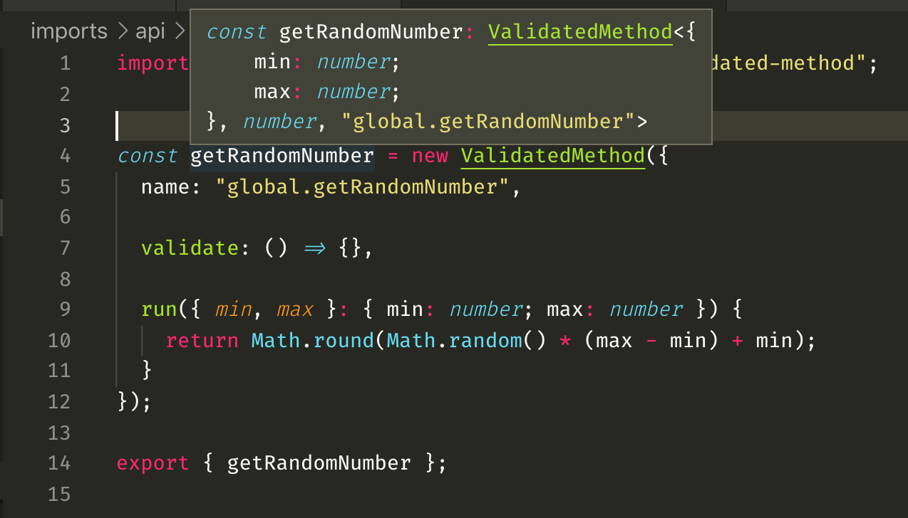
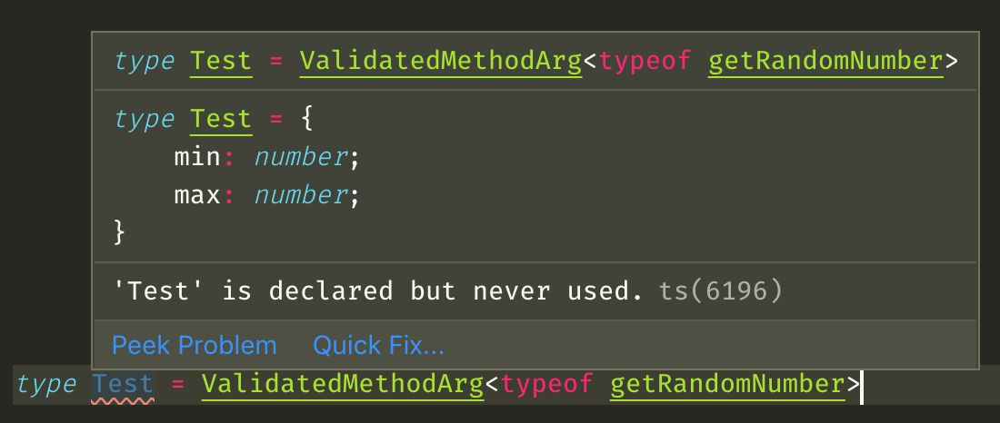
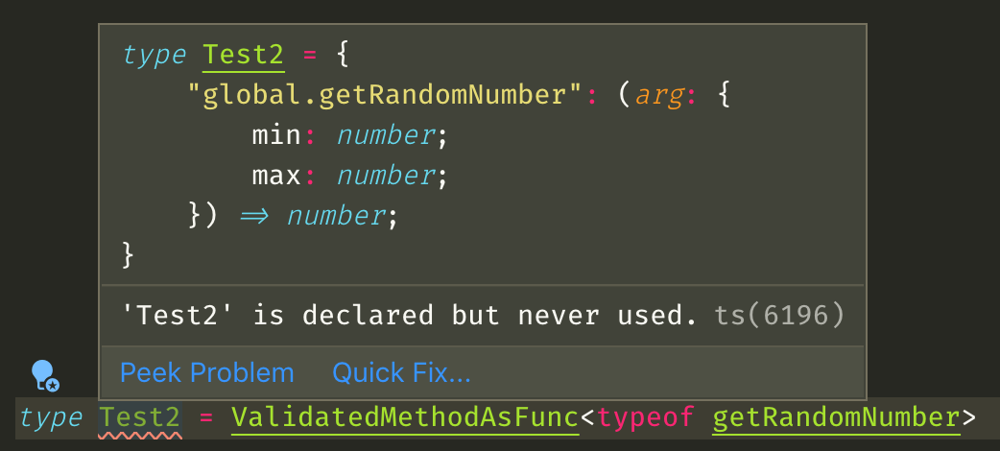
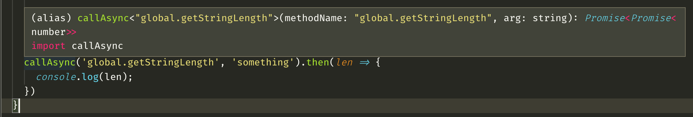
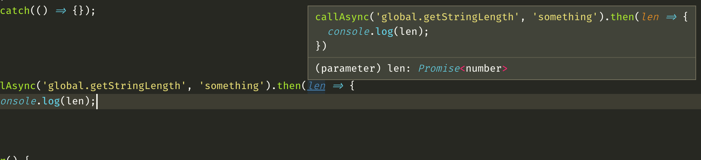
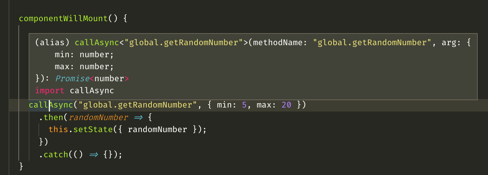
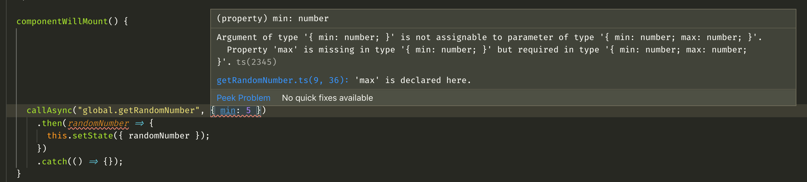
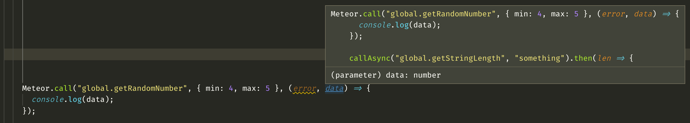

The aim of this article is to present a pattern of typing meteor methods in such a way that Typescript knows which methods are available and also what arguments can be passed or received to/from a specific method.

ValidatedMethod package is the default wrapper around creating meteor methods so we will use it to create the methods instead of relying on the raw meteor option.

The first part "The setup" explains how to setup a project so that you can follow along. It can be skimmed so that you would get an idea how the files are structured (even though there will not be a lot of files).

You can also check the [nicu-chiciuc/typed-meteor-methods](https://github.com/nicu-chiciuc/typed-meteor-methods) repository to see the final version.

# The setup

I've created a new meteor project using:

`meteor create --release 1.8.2-rc.0 --typescript typed-meteor-methods`

Specific release version is used to have access to the `--typescript` option. Although depending when you're reading this, this might not be necessary.

Install ValidatedMethod package:
`meteor add mdg:validated-method`

Add file `/imports/api/methods/getRandomNumber.js`:

```javascript
import { ValidatedMethod } from "meteor/mdg:validated-method";

const getRandomNumber = new ValidatedMethod({
  name: "global.getRandomNumber",
  validate: null,
  run({ min, max }) {
    return Math.round(Math.random() * (max - min) + min);
  }
});
```

We could use SimpleSchema for the `validate` method but the focus of the article is not on that, so it can be defined as `null`. In production it should not be done like this.

The boilerplate project contains more files than we need. For our puposes we need a file that runs on the backend and one that runs on the frontent.

For the frontend I have the `/imports/ui/App.tsx`:

```javascript
import React from "react";
import { Meteor } from "meteor/meteor";

export default class App extends React.Component {
  state = {
    randomNumber: null
  };

  componentWillMount() {
    Meteor.call(
      "global.getRandomNumber",
      { min: 5, max: 20 },
      (error: Meteor.Error, data: number) => {
        if (data) {
          this.setState({ randomNumber: data });
        }
      }
    );
  }

  render() {
    return (
      <div>
        Random number:
        {this.state.randomNumber === null ? "N/A" : this.state.randomNumber}
      </div>
    );
  }
}
```




And for the server I have the `/server/main.ts`:

```javascript
import { Meteor } from "meteor/meteor";
import { getRandomNumber } from "../imports/api/methods/getRandomNumber";

Meteor.startup(() => {
  console.log(getRandomNumber.call({ min: 4, max: 40 }));
});
```

# Typing the `call` method
Before trying to figure out a way to type the `Meteor.call`, let's start simple, by typing the `getRandomNumber.call()` in `/server/main.ts`.

I found the initial typings here:
https://github.com/meteor-typings/validated-method/blob/master/main.d.ts
They were created by Dave Allen.
```ts
// Type definitions for mdg:validated-method meteor package
// Project: https://atmospherejs.com/mdg/validated-method
// Definitions by:  Dave Allen <https://github.com/fullflavedave>


interface ValidatedMethod_Static {
  new(options: {
    name: string;
    mixins?: Function[];
    validate: (args: { [key: string]: any; }) => void; // returned from SimpleSchemaInstance.validator() method;
    applyOptions?: {
      noRetry: boolean;
      returnStubValue: boolean;
      throwStubExceptions: boolean;
      onResultReceived: (result: any) => void;
      [key: string]: any };
    run: (args: { [key: string]: any; }) => void;
  }): ValidatedMethod_Instance;
}

interface ValidatedMethod_Instance {
  call(args: { [key: string]: any; }, cb?: (error: any, result: any) => void ): void;
  _execute(context: { [key: string]: any; }, args: { [key: string]: any; }): void;
}

declare const ValidatedMethod: ValidatedMethod_Static;

declare module 'meteor/mdg:validated-method' {
  export const ValidatedMethod: ValidatedMethod_Static;
}
```

I added the types in a file called `/@types/meteor-validated-method.d.ts`.

The type definitions worked good enough, but it is possible to make them generic, so let's try that.

Below is a modified version of the one linked above.

```ts
declare module "meteor/mdg:validated-method" {
  import { DDPCommon } from "meteor/ddp";
  import { Meteor } from "meteor/meteor";

  type ValidatedMethodOptions<TRunArg, TRunReturn> = {
    name: string;
    mixins?: Function[];

    validate: ((args: TRunArg) => void) | null;

    applyOptions?: {
      noRetry: boolean;
      returnStubValue: boolean;
      throwStubExceptions: boolean;
      onResultReceived: (result: any) => void;
      [key: string]: any;
    };
    run: (this: DDPCommon.MethodInvocation, arg: TRunArg) => TRunReturn;
  };

  export class ValidatedMethod<TRunArg, TRunReturn> {
    constructor(options: ValidatedMethodOptions<TRunArg, TRunReturn>);

    call(args: TRunArg): TRunReturn;
    call(
      args: TRunArg,
      callback: (error: Meteor.Error, result: TRunReturn) => void
    ): void;

    _execute(context: { [key: string]: any }, args: TRunArg): void;
  }
}
```

`Meteor.call` methods can be passed multiple arguments but with `ValidatedMethod`, the standard is passing a single object with multiple properties. This makes it much easier to type since we have a type variable for the input argument (`TRunArg`) and one for the return argument (`TRunReturn`).

Notice that `ValidatedMethod` can also be passed mixins, and options that belong to those mixins, and those should be also typed, but that beyond the scope of this article.

Typescript now knows the return value of `getRandomNumber.call`. It will also err if incorrect arguments are passed.


Before we move forward let's add a small wrapper over the `Meteor.call`.

## The `callAsync` wrapper
As per the documentation, `Meteor.call` should receive a string as the first argument, followed by some parameters to pass to the method, and at the end, a callback can also be passed.
Instead of trying to work around these requirements a simple promise wrapper can be created:

```ts
import { Meteor } from "meteor/meteor";

const callAsync = (methodName: string, arg: any) =>
  new Promise<any>((resolve, reject) =>
    Meteor.call(methodName, arg, (error: Meteor.Error, result: any) => {
      if (error) {
        reject(error);
      } else {
        resolve(result);
      }
    })
  );

export default callAsync;
```

This was introduced by one of my colleagues @barbaros and it probed to be very useful.
Instead of calling the `Meteor.call` in `App.tsx` and passing a callback, a promise can be used:

```ts
// Old way
Meteor.call(
  "global.getRandomNumber",
  { min: 5, max: 20 },
  (error: Meteor.Error, data: number) => {
    if (data) {
      this.setState({ randomNumber: data });
    }
  }
);

// New way
callAsync("global.getRandomNumber", { min: 5, max: 20 })
  .then(randomNumber => {
    this.setState({ randomNumber });
  })
  .catch(() => {})
```

`callAsync` knows that it should receive a string, then a single argument of `any` type and it will return an untyped promise.
This level of strong typing might be enough for most people, and it did for us for some time. But, wouldn't it be nice for `callAsync` to know what method names were declared and what types can be passed to a specific method.

# Typing APIs
In many aspects, meteor methods are similar to REST API calls. Since I didn't expect there to be many attempts at typing meteor methods, since meteor wasn't thought with Typescript in mind, I started to search for approaches of typing REST APIs using typescript.

Most of the articles and github repositories I've found relied on the existence of a global interface that contained all the data about the name, arguments and return values of all the REST endpoints.

This would be a smart approach. But forcing to catalogue all the methods by hand and afterwards keep the implementation in sync seemed like too much of a hastle. A better approach would be to leave the implementation as they are and extract the needed types for further use.

## Typing the name of the function

Now comes the cool part. The `ValidatedMethods` type definition has to be augmented so that it knows the name of the function as a string literal as opposed to a string.
Compared to most other typed languages, Typescript has the concept of string literals, which allows to, for example type semaphores colors like so:

```ts
const semaphore: 'yellow' | 'red' | 'green' = 'green';
```

An additional generic type variable seems to do the trick:

```ts
type ValidatedMethodOptions<TRunArg, TRunReturn, TName extends string> = {
  name: TName;
  mixins?: Function[];

  validate: ((args: TRunArg) => void) | null; // returned from SimpleSchemaInstance.validator() method;
  applyOptions?: {
    noRetry: boolean;
    returnStubValue: boolean;
    throwStubExceptions: boolean;
    onResultReceived: (result: any) => void;
    [key: string]: any;
  };
  run: (this: DDPCommon.MethodInvocation, arg: TRunArg) => TRunReturn;
};

export class ValidatedMethod<TRunArg, TRunReturn, TName extends string> {
  constructor(options: ValidatedMethodOptions<TRunArg, TRunReturn, TName>);

  call(args: TRunArg): TRunReturn;
  call(args: TRunArg, callback: (error: Meteor.Error, result: TRunReturn) => void): void;

  _execute(context: { [key: string]: any }, args: TRunArg): void;
}
```

Typescript correctly infers the type of name as a string literal instead of a string:

The only thing that has to be typed is the argument to the run function, and maybe its return type if it has to be enforced.


### Notes on the TName
When I started writing this article I mistakenly assumed that Typescript is inferring the type of name as a simple string. To overcome this problem I had to do some tricks to enforce it.

We were using the following code:

```ts
export type UnionToIntersection<U> = (U extends any ? (k: U) => void : never) extends ((k: infer I) => void)
  ? I
  : never;
export type CheckForUnion<T, TErr, TOk> = [T] extends [UnionToIntersection<T>] ? TOk : TErr;
```

and then type the `name` as follow:

```ts
type ValidatedMethodOptions<TRunArg, TRunReturn, TName extends string> = {
// Force the name to be a string literal
name: TName & CheckForUnion<TName, never, {}>;;

...
} 
```

You can read more in [this StackOverflow answer](https://stackoverflow.com/a/56375136/2659549).

Fortunately I was mistaken, and Typescript correctly infers the name of the method as a string literal.


# Creating a unified API
Even though each specific method is fully typed, we somehow need to gather all the instances and create a unified type so that `callAsync` knows what's going on.

The solution is inspired by the ["Strongly Typed Event Emitters with Conditional Types" article by Brian Terlson](https://medium.com/@bterlson/strongly-typed-event-emitters-2c2345801de8) in which he proposes a solution for a similar problem for event emitters.

Below is an excerpt from the article:

```ts
// Gist: https://gist.github.com/bterlson/9d08928ee1147907e063e20ba95fc97f#file-medium-keyof-example-ts
interface Position { x: number, y: number };
interface Events {
  mouseMove: Position,
  done: void
}

// Same as Position, but using indexed access operator
type MouseMovePayloadType = Events['mouseMove'];

interface TypedEventEmitter<T> {
  on<K extends keyof T>(s: K, listener: (v: T[K]) => void);
  // and so on for each method
}

declare const myEventEmitter: TypedEventEmitter<Events>;

myEventEmitter.on('mouseMove', function (p) { })
myEventEmitter.on('done', function () { });

myEventEmitter.emit('mouseMove', { x: 1, y: 1 });
myEventEmitter.emit('done', undefined);
```

The keys in the `Events` interface represent the name of the events and the value represents the type of the value that should be passed and received from the an event of that specific name.

The most important part happens in the `on` method definition which has to be passed and argument of type `K` which should be a key in the `Events` interface. Afterwards the `on` method is typed so that it knows what will be the type of the listener. The same approach can be applied to the `emit` method and all the others.

Applying this logic to the `ValidatedMethods` we could imagine an interface that could look like this:

```ts
interface TypedMethods {
  'global.getRandomNumber': (arg: {min: number; max: number}) => number;
  'global.getStringLength': (arg: string) => number;
}
```

In our case we have 2 values to take care of, the argument type and the return type. A natural choice is to store the value as a function type.

### Notes on tagged unions

A different approach would've been to use union types like so:
```ts
type TypedMethods =
  | {
      name: "global.getRandomNumber";
      arg: { min: number; max: number };
      ret: number;
    }
  | {
      name: "global.getStringLength";
      arg: string;
      ret: number;
    };
```

We use union types extensively in our project but for this particular problem they seemed to be harder to work with.

## Extracting the ValidatedMethod types
The problem now boils to somehow transform a type that looks like this:
```ts
ValidatedMethod<{
    min: number;
    max: number;
}, number, "global.getRandomNumber">
```
to a type that looks like this:
```ts
{
  "global.getRandomNumber" : (arg: {min: number; max: number}) => number;
}  
```

Conditional types seem to be the only approach.
We can extract each specific type using the following utility types:
```ts
export type ValidatedMethodName<T> = T extends ValidatedMethod<any, any, infer R> ? R : never;
export type ValidatedMethodArg<T> = T extends ValidatedMethod<infer R, any, any> ? R : never;
export type ValidatedMethodReturn<T> = T extends ValidatedMethod<any, infer R, any> ? R : never;
```

so that, for example the following test type
```ts
type Test = ValidatedMehodArg<typeof getRandomNumber>
```
would have the following type:


The other 2 generic types work in the same way. If you want more info about how the `infer` keyword works, check [Type inference in conditional types](https://www.typescriptlang.org/docs/handbook/advanced-types.html#type-inference-in-conditional-types) in the official documentation.

### Assembling the new type
Since we can extract the generic type variables, we can assemble them back to our desired type like so:
```ts
export type ValidatedMethodAsFunc<T extends ValidatedMethod<any, any, any>> = {
  [K in ValidatedMethodName<T>]: (arg: ValidatedMethodArg<T>) => ValidatedMethodReturn<T>;
};
```
we can test this out and see that indeed it works correctly:


### Constructing the final API
Since we can transform the `ValidatedMethod` generic type to our needed type all that is remained is to assemble all the types.

We can define a `methodTypes.d.ts` in the root of the `imports` folder. Since it will not contain any code that will actually run, it can use the `.d.ts` extension.

```ts
import {
  ValidatedMethod,
  ValidatedMethodAsFunc
} from "meteor/mdg:validated-method";
import { getRandomNumber } from "./api/methods/getRandomNumber";
import { getStringLength } from "./api/methods/getStringLength";

type KnownMethods = ValidatedMethodAsFunc<typeof getRandomNumber> &
  ValidatedMethodAsFunc<typeof getStringLength>;
```

We use the `&` (intersection operator) to augment the types. Basically this:
```ts
{ 'global.getRandomNumber': (arg: {min: number; max: number}) => number; } &
{ 'global.getStringLength': (arg: string) => number; }
```
will be "equal" to this:
```ts
{
  'global.getRandomNumber': (arg: {min: number; max: number}) => number;
  'global.getStringLength': (arg: string) => number;
}
```

## Typing `callAsync`
The `callAsync` wrapper defined earlier has to be updated so that it knows about this `KnownMethods` type:

```ts
import { Meteor } from "meteor/meteor";
import { KnownMethods } from "../methodTypes";
import { FirstArgument } from "meteor/mdg:validated-method";

const callAsync = <TName extends keyof KnownMethods = keyof KnownMethods>(
  methodName: TName,
  arg: FirstArgument<KnownMethods[TName]>
) =>
  new Promise<ReturnType<KnownMethods[TName]>>((resolve, reject) =>
    Meteor.call(methodName, arg, (error: Error, result: any) => {
      if (error) {
        reject(error);
      } else {
        resolve(result);
      }
    })
  );

export default callAsync;

```

This might be harder to digest but let's give it try. The `TName` should be one of the keys in `KnownMethods`, that is, it should be the name of one of the defined `ValidatedMethods`. It is the type of the `methodName` parameter.

The `FirstArgument` utility type is defined as follows:
```ts
export type FirstArgument<T> = T extends (val: infer R) => any ? R : never;
```
It is very similar to the `ValidatedMethodArg` defined previusly. It tries to extract the type of the first argument and returns the `never` type if it cannot.

The `ReturnType` comes with Typescript but it could also be defined similarly:
```ts
// Origin: https://www.typescriptlang.org/docs/handbook/advanced-types.html#type-inference-in-conditional-types
type ReturnType<T> = T extends (...args: any[]) => infer R ? R : any;
```

`KnownMethods[TName]` returns the value of a specific function name from the `KnownMethods` type that we defined. For example if `TName` were to be `"global.getRandomNumber"`, then `KnownMethods[TName]` would've been `(arg: {min: number; max: number}) => number`.

Since we need just the type of the argument, we use `FirstArgument<KnownMethods[TName]>` which would become `{min: number; max: number}` in our specific example.

The return value of `callAsync` is implied because we type the `Promise` constructor using `ReturnType<KnownMethods[TName]>`. The logic is the same as before.

The code of the function remains the same. One unfortunate thing is that the `Promise` accepts just one generic type so we cannot type the error value. The `Meteor.call` callback doesn't return a simple `Error` but a `Meteor.Error`. Unfortunately we cannot capture this. You can find more about this in the [following github issue](https://github.com/microsoft/TypeScript/issues/6283).

### The `Promise<Promise<T>>` gotcha
Not all `ValidatedMethods` are synchronous, some of them may return a promise, and Typescript can get confused.
Suppose the `getStringLength` method (briefly mentioned previously) is defined as follows:
```ts
const getStringLength = new ValidatedMethod({
  name: "global.getStringLength",

  validate: null,

  run(str: string) {
    return Promise.resolve(str.length);
  }
});

export { getStringLength };
```

Typescript will report the following types:


which are incorrect since a promise boxed inside another promise will still be a promise.

We can use another utility type to solve this issue:
```ts
type UnpackPromise<T> = T extends Promise<infer U> ? U : T;
```
If `T` is a `Promise`, return its boxed type, if it is not, return `T`.
Plugging this in will result in the following final version of `callAsync`:
```ts
type UnpackPromise<T> = T extends Promise<infer U> ? U : T;

const callAsync = <K extends keyof KnownMethods = keyof KnownMethods>(
  methodName: K,
  arg: FirstArgument<KnownMethods[K]>
) =>
  new Promise<UnpackPromise<ReturnType<KnownMethods[K]>>>((resolve, reject) =>
    (Meteor.call as any)(methodName, arg, (error: Error, result: any) => {
      if (error) {
        reject(error);
      } else {
        resolve(result);
      }
    })
  );

export default callAsync;
```
It's a bit messy, but it gets the job done.

## Testing the `callAsync`
Now that everything seems in place, we can check if it actually works as expected.



It knows the type of the arguments that should be passed and it even errs when things are incorrect. Seems like a good combination.


## Notes on typing `Meteor.call`
We could try to apply the same pattern to `Meteor.call` method:
```ts
import { KnownMethods } from "/imports/methodTypes";
import { Meteor } from "meteor/meteor";

declare module "meteor/meteor" {
  type FirstArgument<T> = T extends (val: infer R) => any ? R : never;

  module Meteor {
    function call<K extends keyof KnownMethods = keyof KnownMethods>(
      methodName: K,
      arg: FirstArgument<KnownMethods[K]>
    ): ReturnType<KnownMethods[K]>;

    function call<K extends keyof KnownMethods = keyof KnownMethods>(
      methodName: K,
      arg: FirstArgument<KnownMethods[K]>,
      callback: (error: Meteor.Error, data: ReturnType<KnownMethods[K]>) => void
    ): void;
  }
}
```

This works as can be seen here:


Yet one of the problems is that it will not show any errors if one of the arguments is incorrect since it will default to the overload defined in `@types/meteor`:
```ts
// https://github.com/DefinitelyTyped/DefinitelyTyped/blob/master/types/meteor/meteor.d.ts#L76
function call(name: string, ...args: any[]): any;
```

This can be solved by removing that line using a post-install script (which we didn't adopt because it was too much of a hack for us), by creating another wrapper and typing it instead or by using other creative way.

## Notes on `@ts-check`
Even if your meteor project doesn't use typescript yet, you can still use this pattern by using the `@ts-check` comment. It works best with VsCode.
For example the following method is also fully typed. You can read more about `@ts-check` [here](https://github.com/microsoft/TypeScript/wiki/Type-Checking-JavaScript-Files).
```js
// @ts-check
import { ValidatedMethod } from "meteor/mdg:validated-method";

const reverseString = new ValidatedMethod({
  name: "global.reverseString",

  validate: null,

  /** @param {string} str */
  run(str) {
    return str.split('').reverse().join('');
  }
});

export { reverseString };
```

### Finishing notes
The weakest point in this pattern is the fact that types of `ValidatedMethods` have to be added manually to `KnownMethods`.
I did my best to search for some way to make Typescript automatically aggregate the definition when a new method is created but, unfortunately, I did not find any way to work around this.
An option would be to use a codemod that creates the `typedMethods.d.ts` file automatically, although it would be nice to find a simpler solution.

If you have any idea and/or suggestion about how this could be improved, please comment or contact me in some other way. 

